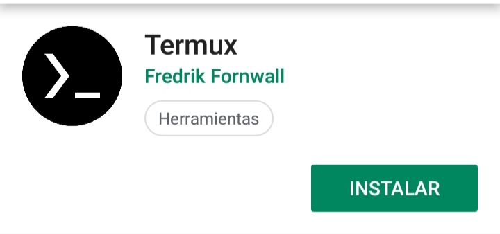
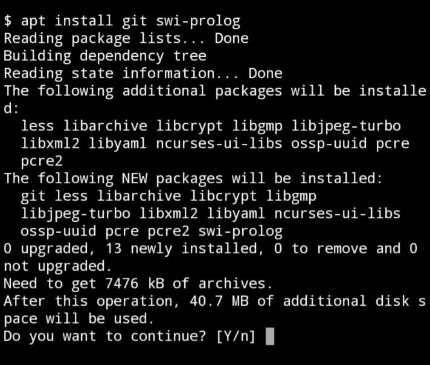

# Instalación y configuración de Swi-prolog y Git en Andorid

En esta página podrás saber cómo instalar y configurar Swi-prolog y Git en nuestro celulares con el sistema Android.

No es muy bueno programa desde el celular comparado con una computadora, pero nos puede servir para practicar cuando no tenemos la compu o falla por algún motivo 😁 .

> **Nota importante:** Deben seguir paso a paso para poder instalar y configurar correctamente cada herramientas. Acuérdense que todos los comandos que aparezcan se deben introducir en la aplicación Termux.

## Paso 1: instalar Termux

Simplemente vamos al Play Store y buscamos la aplicación Termux y le damos a instalar



**Que es Termux?**

Termux es un emulador de terminal Linux. Y nos va a permitir instalar paquetes como una computadora con Linux.

## Paso 2 : Dar permiso a Termux

Una vez instalado, necesitamos dar permisos para que pueda tener acceso a los archivos internos del celular. Para eso abrimos Termux y ejecutamos el siguiente comando.

```bash
termux-setup-storage
```
Le saldrá una ventana y le dan a **PERMITIR**


## Paso 3: Instalar Git y Swi-prolog 

Primero vamos a actualizar los repositorios así podremos descargar las últimas versiones disponibles de los paquetes. Para eso ejecutamos el siguiente comando.

```bash
apt update
```
Una vez terminado de actualizar los repositorios vamos a instalar Git y Swi-prolog con el siguiente comando

```bash
apt install git swi-prolog
```

Al ejecutarlo nos va a salir un mensaje , simplemente escribimos **Y** . 
Le damos a la tecla Enter para instalarlo.



## Configurar la cuenta de Git 

Primero debemos ejecutar el comando.

```bash
git config --global user.name tuUsuario
```
Donde dice **tuUsuario** va el usuario tuyo de GitHub.
Después procedemos con el siguiente comando.

```bash
git config --global user.email tuEmail
```
Donde dice tuEmail va el email con el cual te registraste en GitHub.

Listo ya con estos dos comando quedo configurado tu cuenta para poder descargar, subir código a GitHub.

## Instalación y configuraciones concretadas

Si hiciste todo correctamente y llegaste acá ya tendrías que tener todo listo para ejecutar código de Prolog y también poder subir , descargar , etc a través de Git.

## Como usar Swi-prolog en Andorid

Simplemente abrimos Termux ejecutamos el siguiente comando

```bash
swipl
```


Y ya podremos hacer pruebas.

O podemos también cargar un programa de prolog de la siguiente manera

```bash
swipl nombreDelArchivo.pl
```
Donde dice **nombreDelArchivo.pl** va el nombre nuestro programa . Después de eso, si se pudo cargar el programa podremos hacer las consultas que queramos 

## Cosas a tener en cuenta en Swi-Prolog

Al ejecutar el siguiente comando 

```prolog
make.
```


Nos saldrán unos **Warning** . Simplemente no le den bola a eso. Si solamente les sale esos warning , la sintaxis de su programa es correcto.

Si aparte de los **Warning** les sale **ERROR** es porque en alguna parte del código la cagaron y deberán arreglarlo.

## Otras app útiles 

### Editor de texto QuickEdit

Es un editor de texto que soporta varias sintaxis de varios lenguajes de programación. Con esta app podremos escribir, leer código prolog.


### EF File Explorer

Es un administrador de archivos con muchas funciones. A nosotros nos va a servir una función que nos permite copiar la ruta donde se encuentra una carpeta o archivo. 

¿Para que quiero saber la ruta de la carpeta o el archivo?

Para poder moverme (Con el comando **cd** ), copiar (Con el comando **cp**), etc desde el emulador termux.

Bueno. ¿Y como copio la ruta con esta app?

Abren la app y se dirigen al archivo o carpeta. Luego le dan a los 3 puntos verticales que se encuentran al costado derecho del archivo o carpeta. Le dan en propiedades y se le abrirá una ventana. En esa ventana dejan presionado a donde dice **ubicación** y se copiara automáticamente la ruta . Después van a termux y simplemente pegan esa ruta anteponiendo el comando de lo que quieren hacer . 

Por ejemplo moverse a una carpeta seria así
```bash
cd /carpeta/teletubbies
```


### Simple Markdown

Es un editor de markdown de código abierto . Con el cual podremos crear y editar archivos markdown y también podremos visualizarlo como va quedando .


